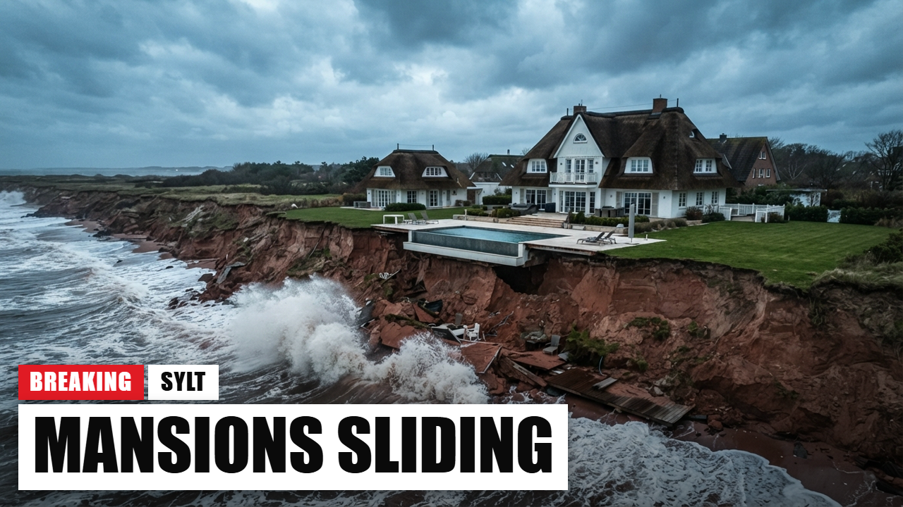
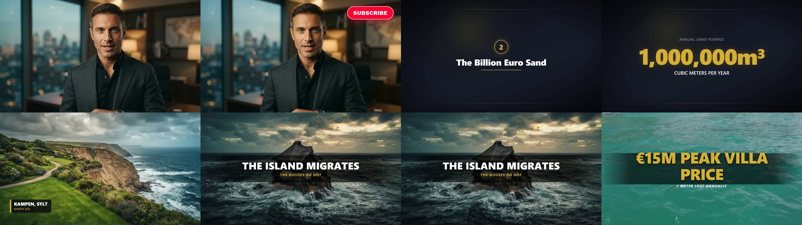
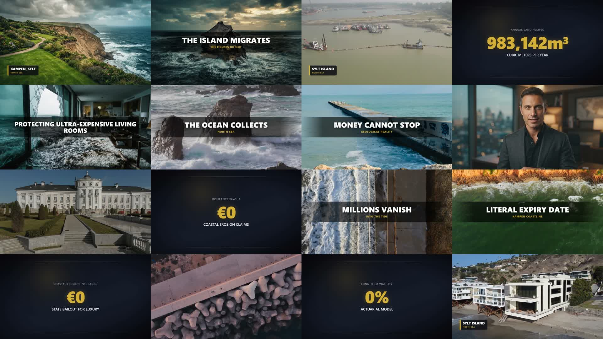

# Machine « Wealth » pour Agent OS

Une usine à vidéos YouTube « faceless » pour la niche **richesse & patrimoine** : des fortunes immobilières identifiables (mansions à 15, 30, 50 millions) que la nature ou un mécanisme financier rend invendables — érosion, glissement de terrain, inondation, incendie, assureur qui se retire, loi qui interdit le mur de soutènement.

Un run part d'une phrase (« les villas de Sylt et la facture de sable payée par le contribuable ») et rend une vidéo 1080p complète : script d'enquête chiffré, voix off, b-roll de banque d'images vérifié plan par plan, rendus IA pour ce que les banques n'ont pas, motion design d'enquête, présentateur IA en lipsync, musique, miniature au code exact des chaînes concurrentes, titre, description et tags.



**Coût mesuré : 0,73 $ pour 5 minutes de vidéo** (voix 0,30 $, images 0,20 $, lipsync 0,38 $, musique 0,06 $, vérification des plans ~0,03 $). Durée : environ 55 minutes de bout en bout, sans intervention.

---

## Ce que la machine fabrique



| Brique | Détail |
|---|---|
| **Script** | Un outline (titre à la formule de la niche, hook, sections avec leur chiffre-clé) puis les sections écrites en parallèle. Ton d'enquête, 2 à 4 chiffres par 100 mots, un aphorisme par section, phrase-pont à chaque fin. |
| **Voix off** | Inworld TTS ou ElevenLabs v3, section par section, puis transcription mot à mot par Whisper qui sert à découper les plans **sur le sens**, jamais sur l'horloge. |
| **Avatar** | Un présentateur IA (image de référence générée ou photo importée) lipsynqué sur la voix, au hook, au CTA et sur les moments forts. **Jamais plus de 10 secondes d'affilée.** |
| **B-roll** | Recherche Pexels, puis **vérification** : trois images de chaque clip sont notées de 0 à 10 par un modèle multimodal face à la description du plan. Sous 6, le clip est rejeté et un autre est cherché ; si rien ne passe, les requêtes sont réécrites ; en dernier recours, l'image est générée. |
| **Rendus IA** | Kie.ai (Nano Banana, Seedream, GPT Image ou Grok) pour ce qui n'existe pas en banque, avec réécriture automatique du prompt en cas de refus de modération. |
| **Motion design** | Compositions Remotion : cartes de section, chiffres animés, listes, citations, **dossiers d'enquête** (chemise « CONFIDENTIAL », photo agrafée, fiche dactylographiée, tampon rouge) et **comparatifs avant/après**. |
| **Textes incrustés** | Le code n°1 de la niche : chiffres chocs et aphorismes en gros, bandeaux de lieu, manchettes de presse — sur la moitié des plans. |
| **Montage** | FFmpeg : zoom, dézoom et panoramiques alternés sur chaque plan, concaténation, musique Suno, bouton d'abonnement, sous-titres optionnels. |
| **Packaging** | Titre à la formule de la niche, description codée, tags, et miniature en deux temps : image de fond sans texte + bandeau « BREAKING » composé par Remotion. |

Tout est **reprenable** : un run interrompu redémarre là où il s'est arrêté, et chaque plan se régénère individuellement sans perdre le reste.

---

## Installation

Prérequis : un Agent OS fonctionnel (le dossier qui contient `agent-os/` et `remotion/`), Node 18+, FFmpeg dans le PATH, et le projet Remotion opérationnel.

```bash
git clone <ce-depot> wealth-machine
cd wealth-machine
node install.js /chemin/vers/agentic-os        # ou --dry pour simuler
```

L'installateur copie les fichiers puis pose lui-même les points de branchement dans `server.js`, `index.html`, `core.js`, `machines.js` et `Root.tsx`. Il est **idempotent** (relançable sans rien dupliquer), écrit une sauvegarde `.bak-wealth` de chaque fichier modifié, et affiche les rares insertions à faire à la main si votre version d'Agent OS diffère.

### Après l'installation

1. **Coffre** (Paramètres → Coffre) : `kie`, `fal`, `pexels`, `openrouter`. Google Drive connecté (les modèles FAL ont besoin d'URLs publiques). Une clé YouTube Data si vous voulez le Labo de niche.
2. `cd remotion && npx remotion compositions` — `WealthMotion` et `WealthThumb` doivent apparaître.
3. Démarrer Agent OS → **Machines → Wealth → onglet Avatars** → créer un présentateur (✨ remplit la fiche, 🎨 génère la référence).
4. Onglet **⚙ Générer** : un sujet (ou 💡 pour une idée tirée de la banque de niche), l'avatar, la durée → **Générer**.

---

## Réglages

**Indispensables à chaque vidéo** : le sujet, l'avatar, la langue et la voix, la durée.

**Réguliers** : parité b-roll / IA, part de motion design, part de textes incrustés, nombre de passages avatar, intro face caméra, musique et son volume, sous-titres, modèle d'images, durée cible d'un plan, mode semi-manuel ou automatique, publication YouTube.

**Paramètres** : tous les chiffres de la niche (débit, rythme, parts), les effets de caméra et leur amplitude, le thème du motion design (quatre couleurs), le style des rendus IA, le moteur de voix, le moteur de texte, le modèle de lipsync, la banque de niche liée.

La machine **mesure le débit réel** de la voix à chaque run et s'en sert pour dimensionner le script suivant : une vidéo demandée à 5 minutes dure 5 minutes.

---

## Le Labo de niche

Inclus dans ce dépôt (`agent-os/lib/lab.js` + `scripts/niche-lab.js`). Il constitue la banque de niche dont la machine tire ses idées, ses codes de titres et ses références de miniatures :

```bash
cd agent-os
node scripts/niche-lab.js --niche "Wealth" --deep 4 https://youtube.com/@Chaine1 @Chaine2 …
node scripts/niche-lab.js --niche "Wealth" --digest      # les mesures agrégées
```

Pour chaque chaîne : la liste complète des vidéos via l'API Data YouTube, puis les plus vues téléchargées en 480p, découpées en plans par FFmpeg, et **analysées image par image** (une image toutes les 2 secondes) par un modèle multimodal qui rend, plan par plan, la nature du visuel, le mouvement de caméra, le texte à l'écran et la requête de banque d'images équivalente. Une synthèse narrative (hook, structure, CTA, rétention) est produite par vidéo.

**Coût : environ 0,02 $ par vidéo de 20 minutes** — la banque livrée ici (13 chaînes, 48 vidéos décortiquées, 9 744 plans) a coûté 0,92 $ pour 3 h 32 de traitement. Les résultats alimentent la Banque de Niches d'Agent OS sans rien changer à son code.

C'est ainsi qu'a été écrite la recette livrée ici : [`agent-os/docs/RECETTE-NICHE-WEALTH.md`](files/agent-os/docs/RECETTE-NICHE-WEALTH.md) — 42 vidéos décortiquées, 370 titres, chiffres mesurés (durée, débit, rythme des plans, parts de stock et de motion, taux de texte incrusté, mouvements de caméra) et codes narratifs et visuels relevés.

---

## Contrôler une vidéo produite

```bash
node agent-os/scripts/check-wealth-run.js <runId>
```

Vérifie les invariants de la recette (aucun passage avatar au-delà de 10 secondes, aucun plan trop long, aucun visuel manquant ou emprunté, durée vidéo égale à la voix, notes de vérification des b-roll) et fabrique deux planches-contact : une vue d'ensemble et les moments clés.



---

## Contenu du dépôt

```
files/agent-os/lib/machines/wealth.js        le moteur de la machine
files/agent-os/lib/pexels.js                 recherche et sélection de b-roll
files/agent-os/lib/lab.js                    Labo de niche (scraping + analyse image par image)
files/agent-os/public/js/pages/wealth.js     l'interface (Générer, Runs, Stock, Avatars, Paramètres)
files/agent-os/scripts/niche-lab.js          le Labo en ligne de commande
files/agent-os/scripts/check-wealth-run.js   le contrôle qualité d'un run
files/agent-os/docs/RECETTE-NICHE-WEALTH.md  la recette de la niche, chiffrée
files/remotion/src/WealthMotion.tsx          motion design (cartes, dossiers, comparatifs, incrustations)
files/remotion/src/WealthThumb.tsx           la miniature (bandeau BREAKING)
server-routes.snippet.js                     le bloc de routes, si vous préférez l'installer à la main
install.js                                   l'installateur
```

La machine s'appuie sur le socle d'Agent OS, qui n'est pas dupliqué ici : `store`, `claude`, `llm`, `vault`, `google`, `tasks`, `spend`, `bank`, `scrap`, `fal`, `ffmpeg`, `youtube`, `apify`.

L'installateur vérifie leur présence et le dit clairement s'il en manque un. Rien d'autre n'est nécessaire : la machine n'ajoute **aucune dépendance npm**.

## Services utilisés

| Service | Rôle |
|---|---|
| OpenRouter (Qwen) | écriture du script, direction visuelle, vérification des b-roll, Labo de niche |
| FAL.ai | voix (Inworld ou ElevenLabs), Whisper, lipsync |
| Kie.ai | images IA, miniature, musique (Suno) |
| Pexels | b-roll vidéo et photo |
| Google Drive | URLs publiques pour les modèles FAL |
| YouTube Data | Labo de niche, publication |
